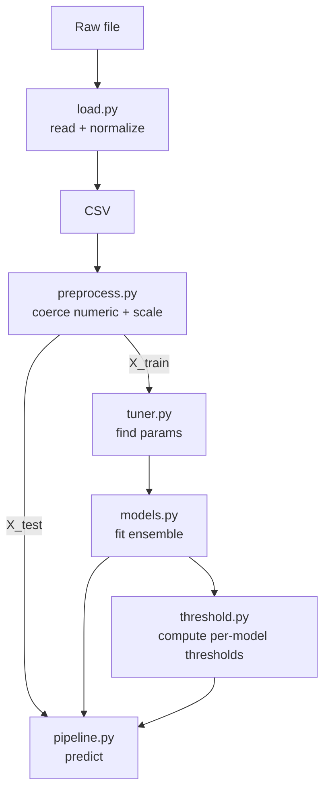

# Agomax: Unsupervised Drone Anomaly Detection

Agomax is a production-oriented Python package for detecting anomalies in drone telemetry using classical unsupervised learning. It trains once on NORMAL flight data, persists all learned artifacts, and then loads to detect anomalies on new or streaming data with an ensemble of models and confidence scoring. Explainability is optional and additive, exposing per-model contributions for each prediction.

## Why Agomax

Drone operations produce high-dimensional telemetry with sparse labels and evolving behavior. Supervised approaches often lack sufficient labeled anomalies and may overfit. Agomax uses an unsupervised ensemble to model normal behavior, flagging deviations robustly without requiring labeled anomalies.

## Architecture

```
load.py        → raw file → CSV (no ML logic)
preprocess.py  → numeric coercion + StandardScaler (fit on train, transform on test)
tuner.py       → hyperparameter tuning on NORMAL data only
models.py      → Ensemble (KMeans, DBSCAN, OPTICS, LOF, OCSVM) + scoring + save/load
threshold.py   → thresholds (default 99.7 percentile; optional MAD)
pipeline.py    → orchestration (fit, save, load, predict)
__init__.py    → exposes Pipeline only
```

Mermaid diagram:



## Modules

- `load.py`: Ingest arbitrary files and normalize to CSV. No feature or ML logic.
- `preprocess.py`: Convert columns to numeric, drop non-convertible/NaN-only columns, handle NaN/Inf, fit a StandardScaler on train and reuse on inference with feature consistency checks.
- `tuner.py`: Tune hyperparameters for each model using NORMAL data only. Keeps anomaly rate bounded using percentile-based flags on model scores.
- `models.py`: Implements the Ensemble of KMeans, DBSCAN, OPTICS, LOF (novelty), and One-Class SVM. Provides `fit(X)`, `score(X)` returning per-model anomaly scores, and `save/load` for persistence.
- `threshold.py`: Robust thresholding utilities. Default is 99.7 percentile of training scores; optional MAD-based threshold.
- `pipeline.py`: Orchestrates training and inference: preprocess → tune → fit ensemble → learn thresholds → save; then load → transform → score → threshold → vote → anomaly + confidence.
- `__init__.py`: Exposes `Pipeline` for package consumers.

## Training flow (normal-only)

1. Load NORMAL flight data to a DataFrame.
2. `Preprocessor.fit(df)` → numeric coercion, scaling, feature list saved.
3. `HyperparameterTuner.tune_all(X_train)` → per-model params, deterministic.
4. `Ensemble.fit(X_train)` → train all models.
5. `threshold.compute_threshold(train_scores)` per model, default 99.7 percentile.
6. Persist `preprocessor`, `ensemble` models, and `thresholds` to disk.

## Inference flow

1. Load the trained pipeline (`Pipeline.load()`).
2. Transform new data with the same features (`Preprocessor.transform(df)`).
3. Score with the ensemble (`Ensemble.score(X)`), producing per-model scores.
4. Threshold per model → binary flags.
5. Vote (mean of flags) → anomaly score in [0,1].
6. Threshold vote at 0.4 → anomaly 0/1.
7. Confidence (lightweight normalization of model scores) → [0,1].
8. Optional explainability: per-row details of model scores, flags, and top contributors.

## Explainability

Explainability is additive and optional. When calling `Pipeline.predict(df, explain=True)`, the function returns a fourth item: a list of per-row dictionaries including:

- `anomaly`: 0/1
- `confidence`: float in [0,1]
- `model_scores`: per-model anomaly scores
- `model_flags`: per-model threshold exceed flags (0/1)
- `top_contributors`: models contributing to the anomaly (flag==1), sorted by score desc

This leverages existing scores and thresholds, adds no heavy compute, and is deterministic.

## Example usage

Train and save:

```python
import pandas as pd
from agomax.pipeline import Pipeline

# Load NORMAL flight data
train_df = pd.read_csv("notebooks/train_normal.csv")

pipe = Pipeline(model_dir="models/")
pipe.fit(train_df)
```

Load and predict:

```python
import pandas as pd
from agomax.pipeline import Pipeline

# New/stream data
test_df = pd.read_csv("notebooks/test.csv")

pipe = Pipeline(model_dir="models/")
pipe.load()

# Backward-compatible prediction
anomaly_score, anomaly, confidence = pipe.predict(test_df)

# With explainability
anomaly_score, anomaly, confidence, details = pipe.predict(test_df, explain=True)
# details[0] example:
# {
#   "anomaly": 1,
#   "confidence": 0.82,
#   "model_scores": {"kmeans": 1.23, "lof": 2.1, "ocsvm": 3.8, ...},
#   "model_flags": {"kmeans": 1, "lof": 1, "ocsvm": 0, ...},
#   "top_contributors": ["ocsvm", "lof"]
# }
```

## Debugging guide

Common failure modes and remedies:

- Import errors: Ensure relative imports (`from .module import ...`) within the package; `__init__.py` must expose `Pipeline` only.
- Empty/invalid data: `Preprocessor.fit()` will error on empty DataFrame or no numeric columns after coercion.
- Feature mismatch: `Preprocessor.transform()` enforces the same features; missing columns raise clear errors.
- NaN/Inf handling: Inputs are cleaned by replacing Inf with NaN and dropping NaN rows.
- LOF novelty mode: LOF must be `novelty=True` for inference; confirmed in `models.py`.
- Persistence paths: Artifacts saved under `model_dir` using `joblib` with explicit filenames; ensure write permissions.
- Thresholding: `threshold.compute_threshold()` validates input shape and finiteness; use 99.7 percentile or MAD.
- Determinism: `random_state=42` is set for models where applicable (e.g., KMeans) and the tuner.

## Limitations & future work

- Temporal dynamics: Current system treats rows independently; temporal/sequence models (e.g., LSTM/Transformers) could improve detection.
- Feature engineering: Domain-specific features may enhance separability while retaining unsupervised training.
- Real-world calibration: Thresholds and vote cutoffs may require calibration to balance false positives and operational risk.
- Data drift: Retraining cadence and drift detection mechanisms can be added.

## Why unsupervised + ensemble

- Label scarcity: True anomalies are rare; unsupervised methods learn normal behavior without labels.
- Robustness: Ensembles combine complementary signals (density, clustering, distance, margin) for stability.
- Interpretability: Each model’s score/flag provides a distinct perspective on deviation.

## Production considerations

- False positives: Monitor exceed rates; adjust per-model thresholds and vote cutoff (default 0.4) conservatively.
- Safety first: Treat anomaly flags as risk indicators; integrate with human-in-the-loop workflows where applicable.
- Logging/monitoring: Capture prediction rates and distribution shifts to trigger retraining.
- Reproducibility: Pin environment, persist artifacts, and use deterministic seeds for repeatable outcomes.
